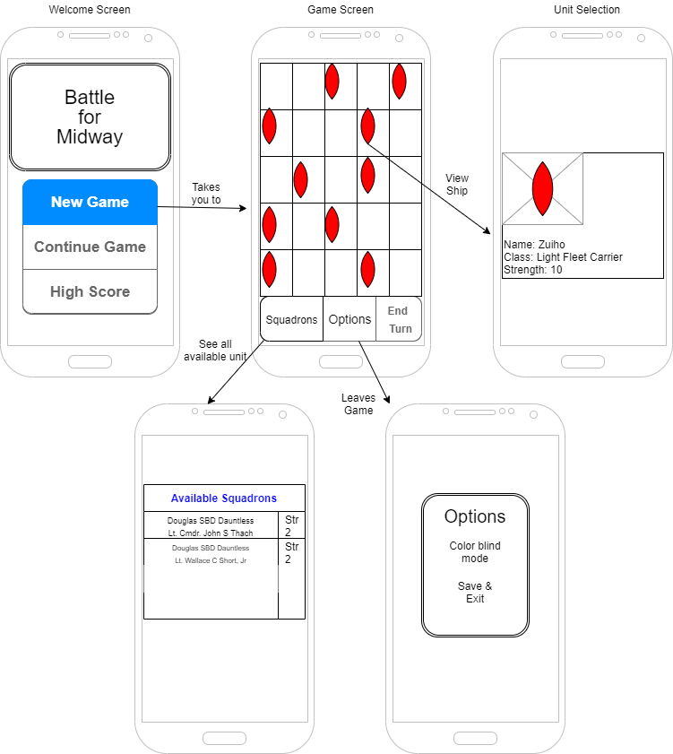
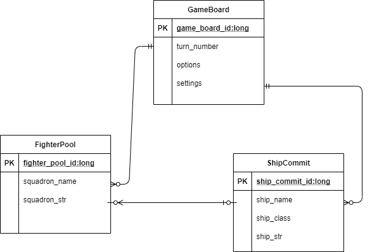

# Battle for Midway

## Summary

The application I am proposing will be a turn-based strategy game. The action will take place on a gameboard divided into squares. The player, representing the United States will be utilizing a large host of aircraft whose objective is to ascertain the location of the Imperial Japanese Navy, and upon locating, destroy all enemy vessels. The player has ten turns to complete the total annihilation of the Japanese fleet before they reach the United States base at Midway. If the opponent has not been defeated by turn ten, the Japenese invasion army lands on Midway and the game is lost.

## Intended users

* People who enjoy playing strategy games.

	> As a person who grew up playing board and computer based games I want to be able to experience turn-based strategy games in new scenarios that enable me to envoke the same nostalgia I used to have growing up playing these games.

* People who are interested in history, particularly military history.

	> As someone whose favorite subject is history, I have been reading historical based content for most of my adult life. I want to be able to experience what I read about from my android device so I may immerse myself in these historical situations.

## Functionality

* Board will be a grid of squares
* Play as United States air forces in the Battle of Midway
* Fight against the might of the Japenese navy and attempt to destroy 10 of their largest ships
* Disperse your squadrons of aircraft to explore the board and locate the position of enemies
* Allied fighters will be assigned to squares of the grid to reveal enemies, and commit to fight the enemies when revealed
* Commit your fighters, from your pool of squadrons, to annihilate their opponents within 10 turns before they land their invasion force on Midway
* Every turn the Japanese fleet changes it's location and moves closer to the United States base at Midway
* Discover historical information about the type of warefare surrounding the Pacific theater of WWII and the actors involved

## Persistent data

* Custom settings and options
* Game highscore list
* Recording which units were a players most valuable assets
    
## Device/external services

* Android notification services to notify android users that their "Squadrons are ready" 
[Android](https://developer.android.com/training/notify-user/build-notification#java)
* Sharing options with other apps such as social media
	* Ability to share high score on Facebook
	[Facebook](https://developers.facebook.com/products/sharing-facebook)
		[Facebook](https://developers.facebook.com/docs/games/)

			Application will be usable in offline mode!

## Stretch goals/possible enhancements 

1. Inclusion of multiple unit class types
2. Changing size of gameboard grid as time progresses
3. AI advanced targetting options
	* The AI ships will have a chance to shoot down allied fighters that have been committed to attacking
4. Algorithms for advanced battle settings and damage computation
5. Multiple statistcal enhancements for users aircraft as game progresses
6. Additional reinforcement options
7. Map API integration for displaying surface background

## Wireframe

## ERD

